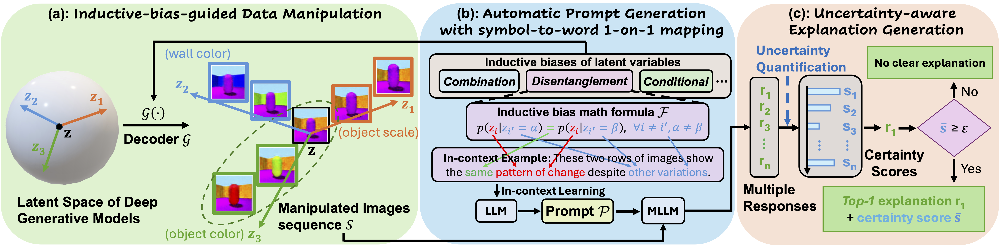

# LatentExplainer

This repository is the official implementation of "LatentExplainer: Explaining Latent Representations in Deep Generative Models with Multi-modal Foundation Models".




## Training/Loading Generative Models and Data Manipulation
To manipulate the latent variables along a semantic latent direction from a pretrained DDPM model:
```bash
bash Diffusion/src/scripts/main_celeba_hf_local_encoder_pullback.sh
```
To manipulate the latent variables with a specific prompt from a pretrained Stable Diffusion model:
```bash
bash Diffusion/src/scripts/main_various_local_encoder_pullback_with_edit_prompt.sh
```
To train β-TCVAE models:
```bash
python betatcvae/betatcvae_train.py 
```
To manipulate the latent variables along each latent dimension for β-TCVAE models and compare:
```bash
python betatcvae/betatcvae_test.py 
```

To train CSVAE models:
```bash
python csvae/csvae_train.py --dataset 'celeba'
```
To manipulate the latent variables with a specific property for CSVAE models:
```bash
python csvae/csvae_test.py --dataset 'celeba'
```


## Evaluation of LatentExplainer
To find the best explanation with the highest similarity, the threshold of a clear explanation and to compute the certainty scores:
```bash
python evaluation/auc_cossim.py 
```
When you have the folders of the explanations with the highest similarity and human references ready, you can compute the metrics:
```bash
python evaluation/metrics.py 
```
## Acknowledgement
The training and data manipulation code is built upon [CSVAE](https://github.com/alexlyzhov/latent-subspaces), [PCVAE](https://github.com/xguo7/PCVAE), [β-TCVAE](https://github.com/rtqichen/beta-tcvae), and [Diffusion Pullback](https://github.com/enkeejunior1/Diffusion-Pullback/tree/main).
